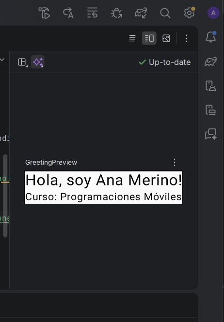
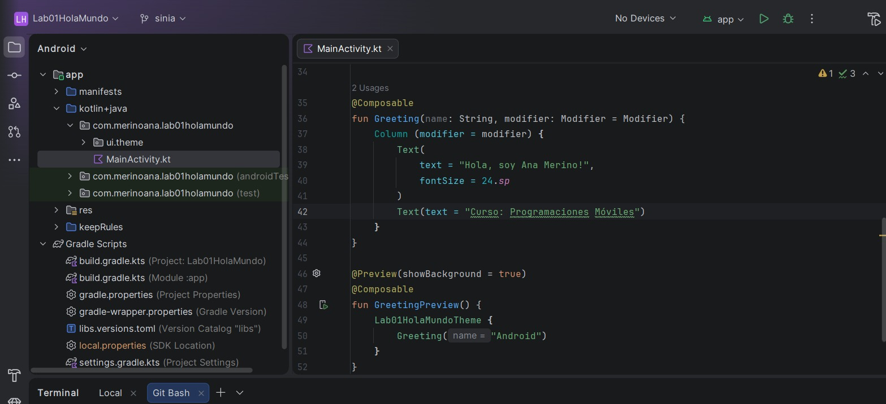
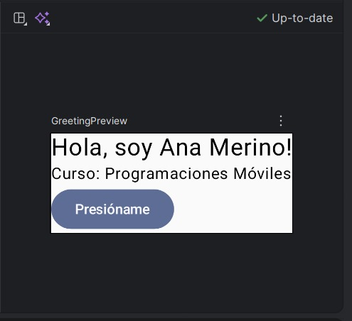
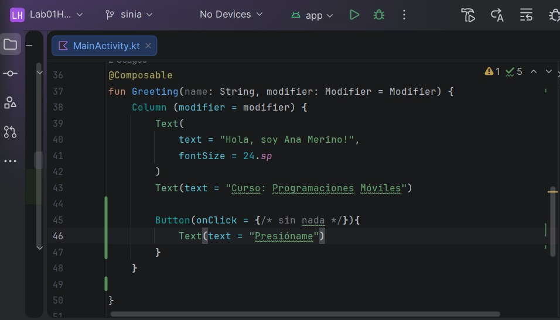
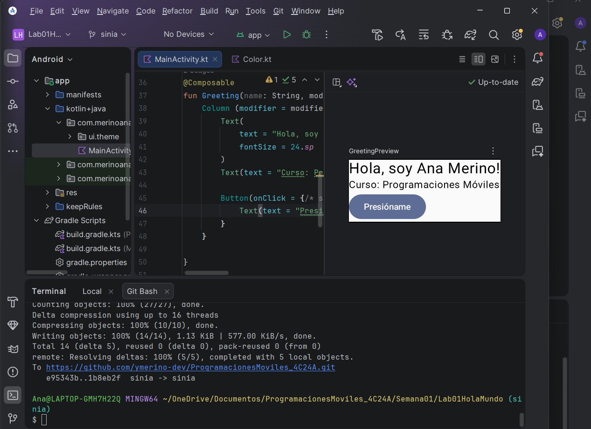

# Laboratorio 01: Android Studio y GitHub

**Alumno:** Ana Yanira Merino Ramos
**Curso:** Programación en Móviles (4to Ciclo)
**Docente:** Juan José León Suiyon

## Descripción de la Aplicación
Esta es mi primera aplicación desarrollada en Android Studio utilizando Kotlin y Jetpack Compose. La aplicación muestra una interfaz básica con un saludo personalizado, el nombre del curso, un botón interactivo y un tema de colores modificado.

## Capturas de Pantalla

---
## Preguntas de Reflexión 

**1. ¿Qué diferencia hay entre Git y GitHub?**
* **Respuesta técnica:** Git es el sistema de control de versiones que registra los cambios localmente en mi computadora. GitHub es la plataforma en la nube donde publico y respaldo esos repositorios.
* **Para entenderlo mejor:** Imagina que compones música. **Git** es tu programa de grabación en tu computadora donde guardas cada toma y arreglo. **GitHub** es como Spotify o SoundCloud: la plataforma en internet donde subes tu canción final para respaldarla y que otros la escuchen.

**2. ¿Qué es un composable y qué indica la anotación @Composable?**
* **Respuesta técnica:** Un composable es una función de Kotlin que define la interfaz gráfica. La anotación `@Composable` le indica al sistema que esa función construirá elementos visuales.

**3. ¿Para qué sirve el archivo .gitignore en tu proyecto?**
* **Respuesta:** Sirve para indicar qué carpetas o archivos pesados e innecesarios (como la carpeta `build`) NO deben subirse a GitHub.
* **Para entenderlo mejor:** Es como el guardia de seguridad en la puerta de tu estudio de grabación. Tú le das una lista negra (el `.gitignore`) indicando quién no puede pasar. Así evitas subir a internet tus "bloopers", ruidos de fondo o archivos pesados que no sirven para el disco final.

**4. ¿Qué hace la función Column en tu código?**
* **Respuesta técnica:** Organiza los elementos visuales (como los textos y el botón) uno debajo del otro de forma vertical.

**5. Historial de commits y cambios realizados:**
*(Analogía: Mis commits son como guardar las versiones de una canción: "Grabé la batería", "Añadí la guitarra", "Mezcla final").*

* **Commit 1:** `"Proyecto inicial: Hola Mundo con Jetpack Compose"`
    * *Cambio:* Creación del proyecto base y la estructura inicial requerida.
* **Commit 2:** `"Agrega saludo personalizado con nombre y curso"`
    * *Cambio:* Modifiqué los textos principales para mostrar mi nombre y el curso.
* **Commit 3:** `"Agrega botón Presióname en la interfaz principal"`
    * *Cambio:* Implementé el composable Button debajo de los textos.
* **Commit 4:** `"Modifica colores base del tema de la aplicación"`
    * *Cambio:* Cambié los códigos hexadecimales en `Color.kt` para personalizar la paleta de colores.