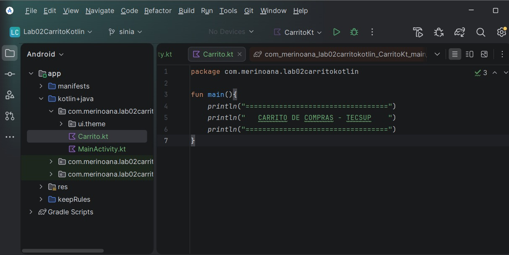
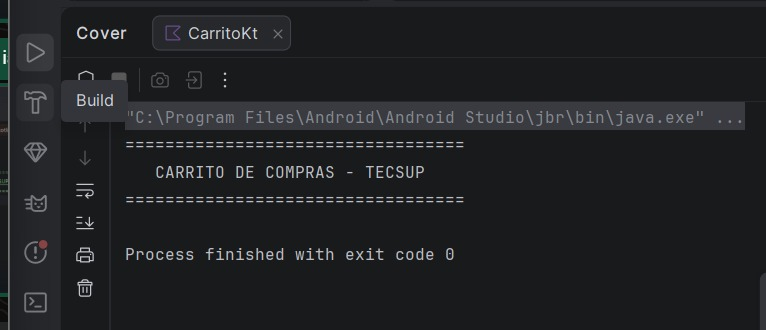
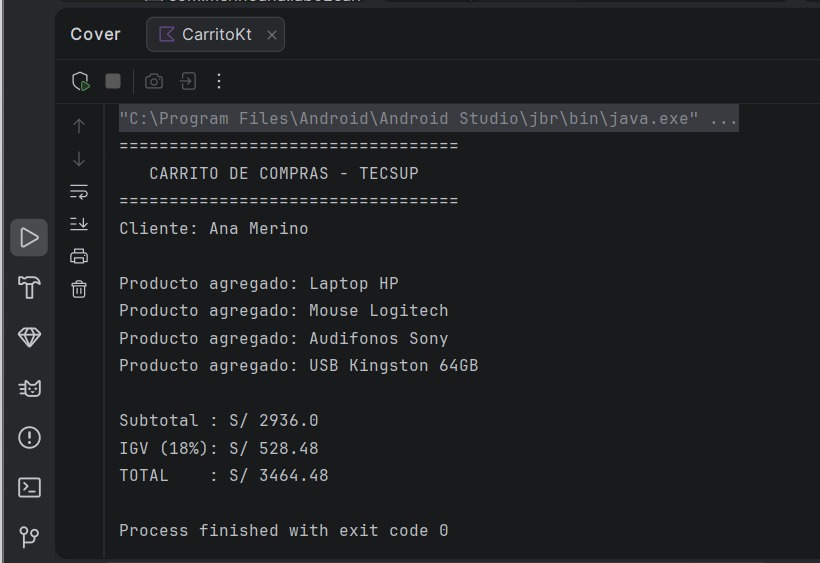

# Laboratorio 02: Carrito de Compras en Kotlin

**Alumno:** Ana Yanira Merino Ramos
**Curso:** Programación en Móviles (4to Ciclo)
**Docente:** Juan José León Suiyon

## Descripción
Aplicación de consola en Kotlin que simula un carrito de compras. Utiliza una `data class` para modelar los productos, funciones para modularizar los cálculos matemáticos (Subtotal, IGV, Total), y estructuras de decisión (`when`) para aplicar descuentos.

## Resultado en Consola

---

## Respuestas para Defensa Oral

**1. ¿Cuál es la diferencia entre val y var?**
* `val` es inmutable (no cambia, como mi fecha de nacimiento). En mi código, el `precio` y el `nombre` del producto son `val`.
* `var` es mutable (sí puede cambiar, como mi edad). En mi código, la `cantidad` es `var` porque el cliente puede agregar o quitar unidades de un producto.

**2. ¿Qué ventajas tiene una data class frente a variables sueltas?**
* Agrupa toda la información relacionada en un solo "molde". En lugar de tener 3 variables sueltas (nombre, precio, cantidad) por cada producto que agregue, la `data class` me permite empaquetarlas en un solo objeto ordenado.

**3. ¿Qué recibe y qué devuelve tu función calcularIGV?**
* Recibe un dato de tipo `Double` (el subtotal). El `: Double` al final de su firma significa que me devolverá como resultado otro número con decimales (el monto del impuesto).

**4. ¿Por qué usamos mutableListOf y no listOf para el carrito?**
* Porque `listOf` crea una lista bloqueada (fija) a la que no le puedo agregar nada. `mutableListOf` crea una lista flexible que me permite usar la función `.add()` para meter más productos al carrito.

**5. ¿Cómo funciona el when en tu función calcularDescuento?**
* Actúa como un semáforo inteligente evaluando condiciones en orden. Primero revisa si la compra supera los 5000; si es verdad, aplica 10% y se detiene. Si no, pasa a la siguiente luz y revisa si supera los 3000 (aplica 5%). El `else` es la luz roja: si no cumplió ninguna, el descuento es 0.0.