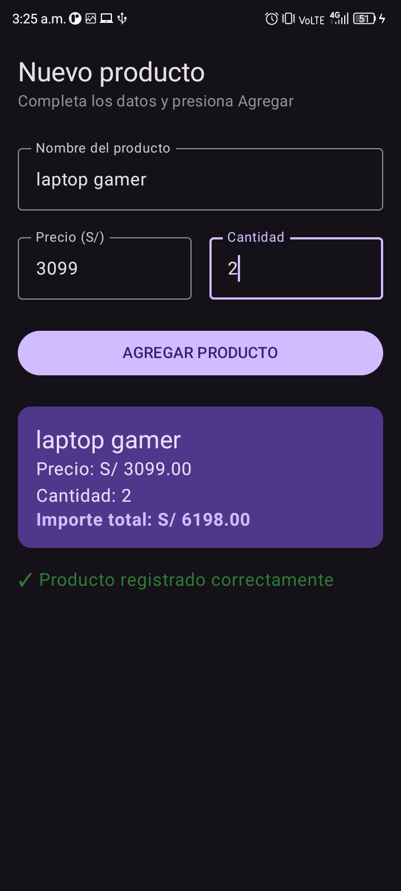

# Laboratorio 03: Registro de Producto (Jetpack Compose)

**Alumno:** Ana Yanira Merino Ramos
**Docente:** Juan José León Suiyon
**Salón:** C24A

## Descripción del Proyecto
Esta es una aplicación móvil desarrollada con la moderna herramienta Jetpack Compose. Muestra una interfaz gráfica interactiva que permite a los usuarios registrar un nuevo producto ingresando su nombre, precio y cantidad. Al procesar los datos, calcula matemáticamente el importe total y revela una tarjeta inferior (Card) de resumen con el resultado formateado a dos decimales.

## Capturas de Pantalla
|          Formulario Vacío           |         Producto Registrado         |
|:-----------------------------------:|:-----------------------------------:|
|  |  |

## Pregunta de Reflexión
**¿Qué pasaría si declaras las variables de los campos SIN `remember`?**
Si declaramos una variable de estado (como el texto de un OutlinedTextField) usando solo `mutableStateOf` pero sin envolverlo en `remember`, la pantalla perdería la memoria. Cada vez que el usuario escriba una sola letra, Compose redibujará la pantalla (recomposición) y la variable se reiniciará inmediatamente a su valor original vacío (`""`). Como resultado, el texto en la caja desaparecería al instante y el usuario nunca podría terminar de escribir una palabra completa.