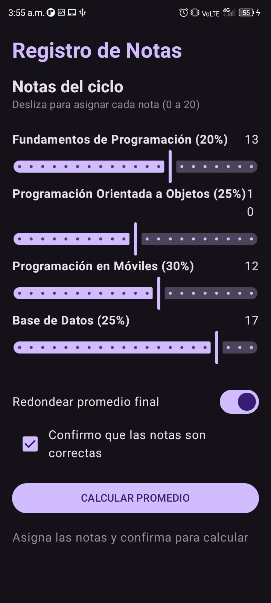
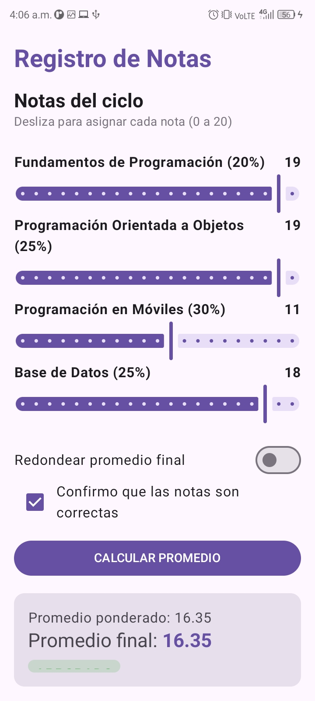

# Práctica 03: Registro de Notas (Jetpack Compose)

**Alumno:** Ana Yanira Merino Ramos
**Docente:** Juan José León Suiyon
**Salón:** C24A

## Descripción del Proyecto
Esta aplicación móvil calcula el promedio ponderado de cuatro cursos de programación utilizando Jetpack Compose. El proyecto introduce el manejo de estado en controles interactivos avanzados, incluyendo `Slider` para la asignación visual de notas (0 a 20), `Switch` para habilitar el redondeo matemático del resultado final, y `Checkbox` para condicionar la habilitación del botón de cálculo.

El sistema aplica reglas de negocio específicas utilizando la estructura `when` para determinar la observación final del alumno ("EXCELENTE", "APROBADO", "EN RECUPERACIÓN" o "DESAPROBADO") y renderiza dinámicamente colores de alerta según el rendimiento.

## Capturas de Pantalla
|          Estado Inicial          |        Promedio Calculado         |
|:--------------------------------:|:---------------------------------:|
|  |  |