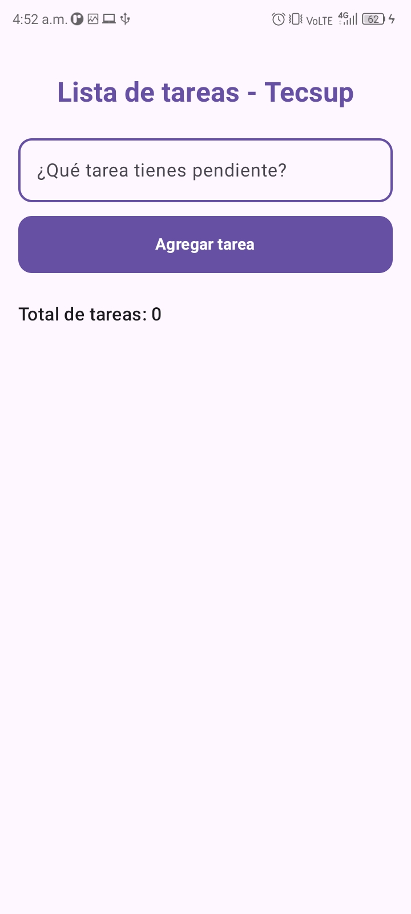
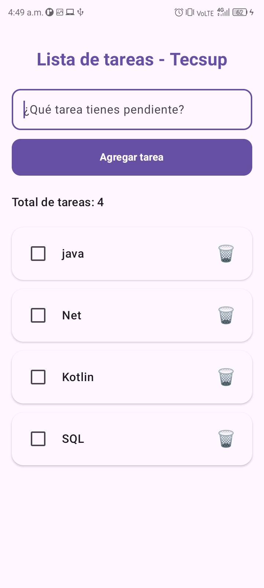

# Laboratorio 04: Manejo de Estados (Versión Con IA)

**Alumno:** Ana Yanira Merino Ramos
**Docente:** Juan José León Suiyon
**Curso:** Programación en Móviles

## Mejora de Interfaz con IA (Gemini / Studio Bot)
Para esta versión del laboratorio, se utilizó el chat de IA para transformar la interfaz básica en un diseño moderno, aplicando Material Design 3.

### Estructura del Prompt Utilizado
Se aplicó la estructura solicitada en la guía del laboratorio:

* **[rol]:** un diseñador experto en Android (UI/UX).
* **[tarea]:** mejores el diseño visual del código de mi aplicación de lista de tareas en Jetpack Compose.
* **[contexto]:** estudiantes universitarios que necesitan una interfaz moderna y atractiva.
* **[formato]:** código Kotlin listo para copiar y pegar, explicando brevemente los cambios visuales realizados.
* **[restricciones]:** El título debe decir 'Lista de tareas - Tecsup', el placeholder '¿Qué tarea tienes pendiente?', el botón debe tener bordes redondeados y un color oscuro, y la lista de tareas (ItemTarea) debe verse como tarjetas redondeadas blancas con un ícono de papelera. No modifiques la lógica de los estados.

### El Prompt Final (Enviado a la IA)
> "Actúa como un diseñador experto en Android (UI/UX). Necesito que mejores el diseño visual del código de mi aplicación de lista de tareas en Jetpack Compose. Esto está dirigido a estudiantes universitarios que necesitan una interfaz moderna y atractiva. Quiero que respondas en formato de código Kotlin listo para copiar y pegar, explicando brevemente los cambios visuales realizados. Ten en cuenta estas condiciones: El título debe decir 'Lista de tareas - Tecsup', el placeholder '¿Qué tarea tienes pendiente?', el botón debe tener bordes redondeados y un color oscuro, y la lista de tareas (ItemTarea) debe verse como tarjetas redondeadas blancas con un ícono de papelera. No modifiques la lógica de los estados."

## Capturas de Pantalla
|             Lista Vacía             |          Tareas Agregadas          |
|:-----------------------------------:|:----------------------------------:|
|  |  |