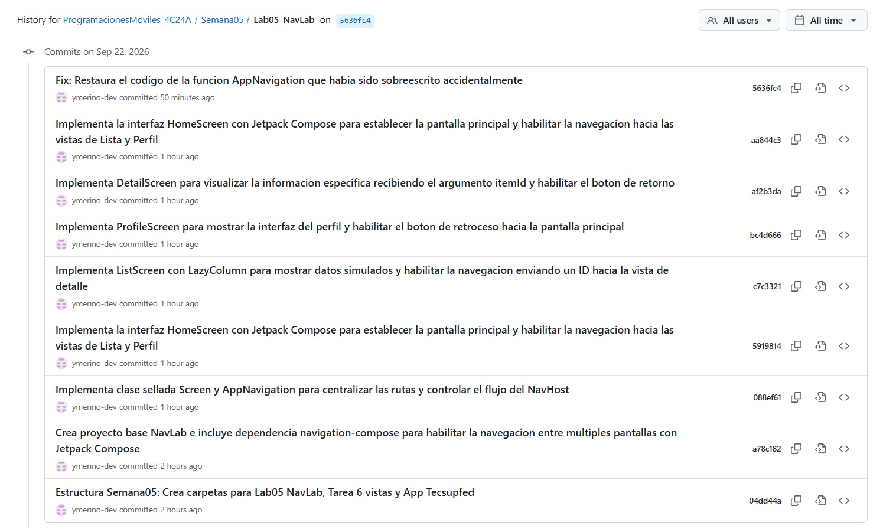
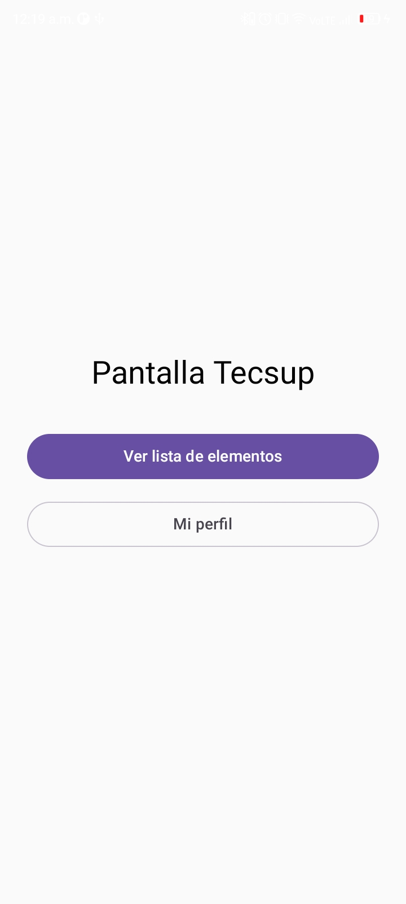
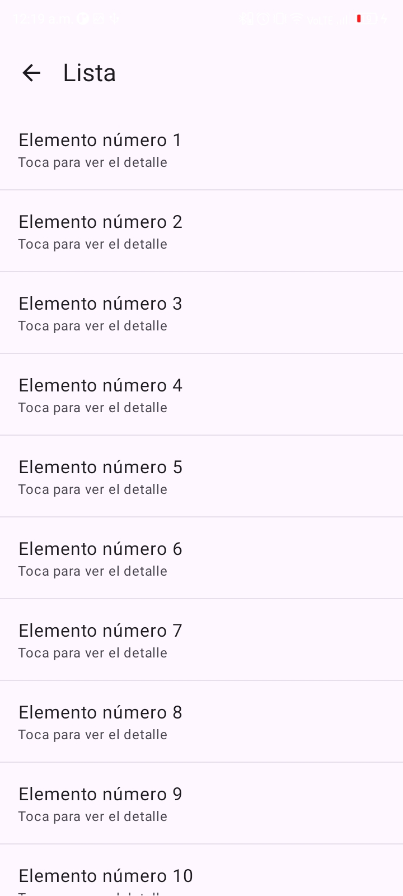
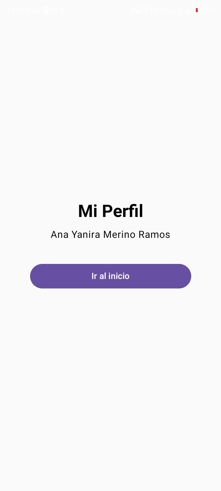
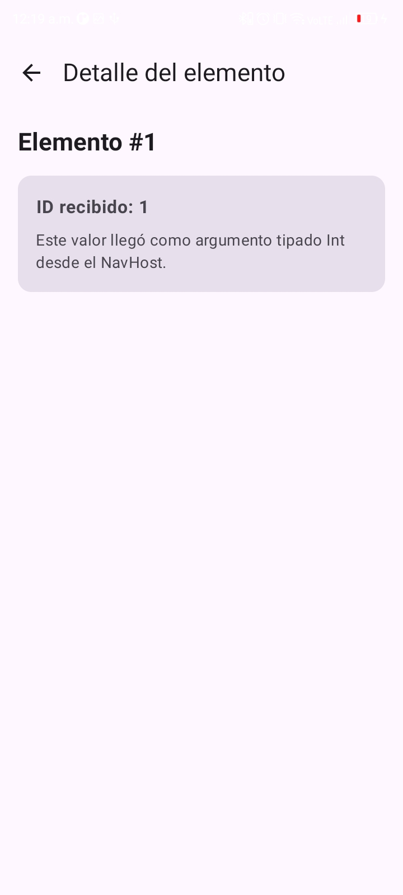

# Laboratorio 05 - Navegación en Jetpack Compose

**Alumna:** Ana Yanira Merino Ramos  
**Curso:** Programaciones Móviles  
**Rama:** sinia

## Descripción del Proyecto
Implementación de un sistema de navegación entre múltiples pantallas utilizando la librería `androidx.navigation.compose`. Se ha configurado el envío de parámetros entre rutas y el manejo de la pila de navegación (back stack) respetando el diseño base del laboratorio.

---

## 📸 Capturas de Evidencia

### 1. Historial de Commits (Git)

  

### 2. Resultados de la Aplicación (Emulador)

|                       Pantalla de Inicio                        |                   Pantalla de Lista                    |
|:---------------------------------------------------------------:|:------------------------------------------------------:|
|  |  |

|                    Pantalla de Perfil                    |                        Pantalla de Detalle                         |
|:--------------------------------------------------------:|:------------------------------------------------------------------:|
|  |  |

---

## 📝 Cuestionario

**1. ¿Qué componente se utiliza para definir el grafo de navegación (las rutas) en Jetpack Compose?**  
Se utiliza el componente central llamado `NavHost`. Este componente necesita un `NavController` para gestionar las acciones de navegación y un `startDestination` que indica la pantalla inicial. Dentro del bloque de `NavHost`, registramos cada pantalla del aplicativo utilizando la función `composable("ruta")`.

**2. ¿Cómo funciona el envío de datos a la pantalla de detalle (DetailScreen)?**  
Para enviar un dato, como un número de ID, primero se define en la ruta que va a recibir un argumento específico: `"detail/{itemId}"`. Cuando el usuario hace clic en un elemento, el `NavController` viaja hacia esa ruta enviando el valor exacto (por ejemplo: `"detail/2"`). Finalmente, el `NavHost` atrapa ese valor extraído de `backStackEntry.arguments` y se lo pasa a la vista `DetailScreen`.

**3. ¿Qué comando se utiliza para programar el botón de "Volver atrás" o regresar al inicio?**  
Para retroceder a la pantalla anterior, se utiliza `navController.popBackStack()`. Por otro lado, si deseamos ir directamente a la pantalla de inicio y además limpiar todo el historial de vistas acumuladas, usamos `navController.navigate(Screen.Home.route) { popUpTo(0) }`.